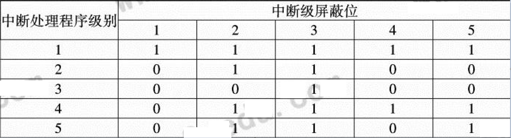

# 第3章 存储、中断、总线与I/O系统

## 3.1 存储系统

### 3.1.1 存储系统的基本要求

存储系统的基本要求是**大容量、高速度和低价格**。存储器容量Sm=W * l * m，其中W是存储体的字长（单位是位或字节），l位存储体的字数，m为并行工作的存储体数。

## 3.1.2 并行主存系统

提高模m值，是能提高主存系统的最大频宽的，但主存实际频宽并不随m值的增大而线性提高的。  
例题：  
设访存申请队的转移概率r为25%，比较在模32和模16的多体单字交叉存储器中，每个周期能访问到的平均字数。   
公式：  

将r=25%、m=32带入上式，可得：  

  
即每个存储周期平均能访问到4个字。  

将r=25%、m=16带入上式，可得：

  
即每个存储周期平均能访问到3.96个字。   

结论：当转移概率r为25%，比较大时，采用模32和16对每个存储周期能访问到的平均字数非常接近。此时提高模m对提高主存实际频宽的影响已经不再显著了。而且模m进一步增加，因为工程实现上的问题，可能还会导致实际性能反而可能比模16更低，且价格更高。所以，模数m不宜太大。

## 3.2 中断系统

### 3.2.1 中断分类

- 访管中断：用户程序需要操作系统介入时，通过执行“访管”指令时发生的；
- 程序性中断：包括指令和数据的格式错误、程序执行中出现异常（非法指令、目态下使用管态指令、主存访问方式保护、寻址超过主存容量、各种溢出、除数为0、有效位为0），程序的事件记录、监督程序对事件的检测引起的中断；
- 外部中断：来自计算机外部，包括各种定时器中断、外部信号中断及中断键中断；
- 输入/输出中断：是CPU与I/O设备及通道联系的工具，在输入/输出操作完成或者I/O通道或设备产生故障时发生；
- 重新启动中断：为操作员或另外一个CPU要启动一个程序所用。

### 3.2.2 中断的分级

不同类的中断被分成不同的中断响应优先级, 让级别高的中断类能优先得到响应。一般在安排中断类响应的优先级时, 将机器校验类中断列为第1 级, 程序性中断和管理程序调用类中断列为第2 级, 其后依次为外部中断、输入输出类中断、重新启动中断。

### 3.2.3 设置中断级屏蔽位的作用及中断嵌套的原则

- 设置中断级屏蔽位的作用：改变各级中断处理程序的中断屏蔽位状态，就可以改变实际的中断处理的先后顺序；
- 中断嵌套的原则： 在处理某级中的某个中断请求时, 只有比其高级的中断请求才可打断正在处理的中断处理程序, 同级或低级的中断请求不能打断正在处理的中断处理程序。

### 3.2.3 例题

1. 若机器有5级中断，中断的相应优先顺序为1>2>3>4>5，现要求其实际的中断处理次序为1>4>5>2>3。设计各级中断处理程序的中断级屏蔽位（令“1”对应与屏蔽，“0”对应于开放）。

     

2. 设中断级屏蔽位“1”对应于开放，“0”对应于屏蔽，各级中断处理程序的中断级屏蔽位设置如下图所示。
   

- 当中断响应优先次序为1→2→3→4时，其中断处理次序是什么?  
  1>4>3>2
- 如果所有的中断处理各需3个单位时间，中断响应和中断返回时问相对中断处理时问少的多。当计算机正在运行用户程序时，同时发生第2、3级中断请求，过两个单位时问后，又同时发生1、4级中断请求，试画出程序运行过程示意图。
  

### 3.2.4 中断系统软硬件功能分配状况

中断系统的软硬件功能分配，实际上就是在中断处理程序软件和中断响应硬件之间的功能分配。**中断系统的功能包括中断请求的保存和清除、优先级的确定、中断断点及现场的保存、对中断请求的分析和处理以及中断返回**。中断系统主要是要有高的中断响应速度，其次是中断处理的灵活性。

## 3.3 总线系统

总线按在系统中的位置分**芯片级、板级和系统级**。按用法分可分为专用和非专用总线。

### 3.3.1 专用总线

只连接一对物理部件的总线称专用总线。

- 优点是多个部件可以同时收/发信息，不争用总线，系统流量高；通信时不用指明源和目的，控制简单；任何总线的实效只会使连于该总线的两个部件不能直接通信，但可以通过其他部件间接通信，系统可靠；
- 缺点是总线数多，而且当总线较长时，成本相当高；时间利用率低；不利于系统模块化。
- 适用于某个设备（部件）仅与另一个设备（部件）的连接。

### 3.3.2 非专用总线

非专用总线可以被多种功能或多个部件分时共享，同一时间只有一对部件可使用总线进行通信。

- 优点是总线数少，造价低；总线接口标准化，模块性强；可扩充能力强，部件的增加不会使电缆、接口和驱动电话激增；易用多重总线来提高总线的带宽和可靠性，使故障弱化。
- 缺点是系统流量下，经常会出现争用总线的情况，使未获得总线使用权的部件不得不等待而降低效率；共享总线实效会导致整个系统瘫痪。
- I/O系统适宜用非专用总线。

### 3.3.3 总线的控制方式

1. 集中式串行链接

- 优点是

  - 选择算法简单，用于解决总线控制分配的控制线的线数少，只需要3根，且不取决于部件的数量；

  - 部件的增减容易，只需简单地把它连接到总线上或从总线上去掉即可，可扩充性好；
  - 逻辑简单，容易通过重复设置提高可靠性；

- 缺点是：
  
  - 对“总线可用”线及其有关电路的失效敏感，如果部件i不能正确传递“总线可用”信号，则部件i之后的所有部件都得不到总线的使用权；
  - 优先级是线连固定，不能由程序改变，不灵活；
  - “总线可用”信号必须顺序脉动地通过各个部件，限制了总线的分配速度；
  - 总线长度限制，增减或移动部件收到限制。

2. 集中式定时查询：  

   - 优点是：优先次序由程序控制，灵活性强；不会因某个部件实效而影响其他部件对总线的使用，可靠性强。
   
   - 缺点是：控制总线的线数较多，需要2+log2N根；可共享总线的部件数受限于定时查询线的线数，拓展性稍差；控制较为复杂；总线分配的速度取决于计数信号的频率和部件数，不能很高。
   
3. 集中式独立请求：

- 优点是：总线分配速度快；控制器可以使用程序可控的预订方式、自适应方式、循环方式或它们的混合方式确定下一个使用总线的部件；能方便地隔离实效部件的请求。
- 缺点是：控制线数量过大，为控制N个设备需要2N+1根控制线，而且总线控制器更复杂。

### 3.3.4 数据宽度

**数据宽度**是I/O设备取得I/O总线后所传数据的总量。**数据通路宽度**是数据总线的物理宽度，即一个时钟周期所传送的信息量。数据宽度有**单字、定长块、可变长块**之分。

- 单字宽度适用于输入机、打印机等低速设备；
- 定长块宽度适用于磁盘等高速设备，可以充分利用总线带宽；
- 可变长块宽度适合于高优先级的中高速磁带、磁盘等设备

## I/O系统

- **字节多路通道**适用于连接大量的像光电机等字符类低速设备。它们传送一个字符的时间很短，但字符间的等待时间很长；
- **数组多路通道**适用于连接多台磁盘等高速设备。这些设备的传送速率很高，但传送开始前的寻址辅助操作时间很长；
- **选择通道**适用于连接优先级高的磁盘等高速设备，让它独占通道，只能执行一道通道程序。