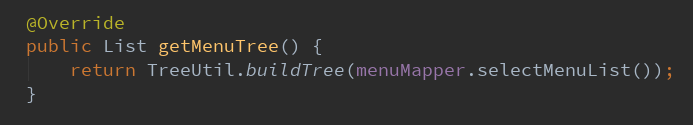
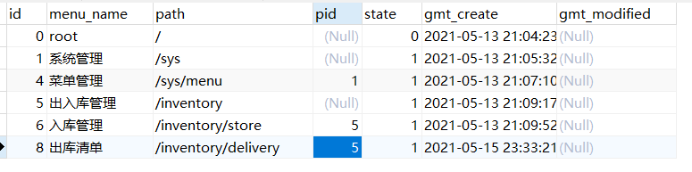

# Java后台封装树形json数据返回（通用类）

**例子为菜单业务数据返回：**

1、创建一个接口，支持树形数据封装的实体类必须实现该接口

```java
import java.util.List;

/**
 * 支持生成树状返回值需要实现此接口
 */
public interface TreeEntity {

    /**
     * 获取当前结点的ID
     * @return
     */
    Long getId();

    /**
     * 获取当前结点的父结点ID
     * @return
     */
    Long getParentId();

    /**
     * 设置改结点的子集
     * @param children 子集
     */
    void setChildren(List children);

    /**
     * 该结点是否为根结点
     * @return 是：true, 否：false
     */
    boolean root();
}

```

2 、需要封装的实体类实现该接口

```java
import com.lemon.inventory.util.treeUtil.TreeEntity;
import lombok.Data;

import java.util.List;

@Data
public class MenuVO implements TreeEntity {

    private Long id;
    private String menuName;
    private String path;
    private Long pid;
    private List<MenuVO> children;

    @Override
    public Long getId() {
        return this.id;
    }

    @Override
    public Long getParentId() {
        return this.pid;
    }

    @Override
    public void setChildren(List children) {
        this.children = children;
    }

    /**
     * 无父结点则判定为根结点
     * @return
     */
    @Override
    public boolean root() {
        return pid == null;
    }
}
```

3、生成树形结构数据返回的通用类

```java
import java.util.ArrayList;
import java.util.Iterator;
import java.util.List;
import java.util.Objects;

/**
 * 生成树形结构数据的通用类
 */
public class TreeUtil {

    /**
     * 遍历当前list生成树形结构数据返回
     * @param <E> 实现TreeEntity接口的类
     */
    public static <E extends TreeEntity> List<E> buildTree(List<E> entityList) {

        List<E> resultTree = new ArrayList<>();

        for (Iterator<E> ite = entityList.iterator(); ite.hasNext(); ) {
            E node = ite.next();
            if (node.root()) {
                resultTree.add(node);
                // 从所有节点列表中删除该节点，以免后续重复遍历该节点
                ite.remove();
            }
        }

        // 给所有根节点设置其子节点
        resultTree.forEach(r -> {
            setSubList(r, entityList);
        });

        // 未找到父节点的节点也添加到list里面去
        if (entityList.size() != 0) {
            resultTree.addAll(entityList);
        }

        return resultTree;
    }


    /**
     * 递归遍历集合，设置当前结点的子结点
     * @param parent 父节点
     * @param entityList 需要遍历的集合
     */
    private static <E extends TreeEntity> void setSubList(E parent, List<E> entityList) {
        List<E> childList = new ArrayList<>();
        Long parentId = parent.getId();
        // 继续遍历其子集
        for (Iterator<E> iter = entityList.iterator(); iter.hasNext(); ) {
            E entity = iter.next();
            if (Objects.equals(parentId, entity.getParentId())) {
                childList.add(entity);
                // 从所有节点列表中删除该节点，以免后续重复遍历该节点
                iter.remove();
            }
        }

        // 如果孩子为空，则直接返回,否则继续递归设置孩子的孩子
        if (childList.isEmpty()) {
            return;
        }
        parent.setChildren(childList);
        childList.forEach(m -> {
            // 递归设置子节点
            setSubList(m, entityList);
        });
    }
}
```

4、测试

在service中调用通用方法buildTree：



数据库结构：



返回数据：

```json
[
    {
        "id": 1,
        "menuName": "系统管理",
        "path": "/sys",
        "pid": null,
        "children": [
            {
                "id": 4,
                "menuName": "菜单管理",
                "path": "/sys/menu",
                "pid": 1,
                "children": null,
                "parentId": 1
            }
        ],
        "parentId": null
    },
    {
        "id": 5,
        "menuName": "出入库管理",
        "path": "/inventory",
        "pid": null,
        "children": [
            {
                "id": 6,
                "menuName": "入库管理",
                "path": "/inventory/store",
                "pid": 5,
                "children": null,
                "parentId": 5
            },
            {
                "id": 8,
                "menuName": "出库清单",
                "path": "/inventory/delivery",
                "pid": 5,
                "children": null,
                "parentId": 5
            }
        ],
        "parentId": null
    }
]
```

5、注意

a. 实体类需要有getter/setter或者用lombok生成。