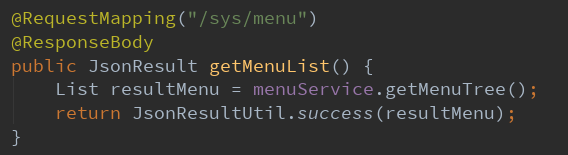
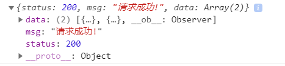

# 封装统一返回格式数据

创建返回结果类，包含status/message/data

```java
import lombok.Data;

/**
 * 封装json类
 * @param <T>需要封装的数据
 */
@Data
public class JsonResult<T> {

    private Integer status;
    private String msg;
    private T data;

    /**
     *
     */
    protected JsonResult() {
    }

    /**
     * 返回状态码、信息及数据
     * @param status 状态码
     * @param msg 信息
     * @param data 返回的数据，可为null
     */
    protected JsonResult(Integer status, String msg, T data) {
        this.status = status;
        this.msg = msg;
        this.data = data;
    }

    /**
     * 返回状态码、信息及数据
     * @param status 状态码
     * @param msg 信息
     */
    protected JsonResult(Integer status, String msg) {
        this.status = status;
        this.msg = msg;
    }
}
```

创建返回数据封装工具类

```java
package com.lemon.inventory.util;

/**
 * Json数据封装工具类
 */
public class JsonResultUtil {

    private static int SUCCESS_CODE = 200;

    private static int ERROR_CODE = 500;

    private static String SUCCESS_MSG = "请求成功!";

    private static String ERROR_MSG = "请求失败!";

    /**
     * 封装成功请求返回的数据
     * @param data 需要返回的data
     * @return 封装后的数据
     */
    public static JsonResult success(Object data) {
        return new JsonResult(SUCCESS_CODE, SUCCESS_MSG, data);
    }

    /**
     * 封装成功请求返回的数据，自定义返回信息提示
     * @param msg 信息提示
     * @param data 需要返回的data
     * @return 封装后的数据
     */
    public static JsonResult success(String msg, Object data) {
        return new JsonResult(SUCCESS_CODE, msg, data);
    }


    /**
     * 封装失败请求
     * @return 返回的失败信息
     */
    public static JsonResult error() {
        return new JsonResult(ERROR_CODE, ERROR_MSG);
    }

    /**
     * 封装失败请求
     * @param msg 返回的信息提示
     * @return 返回的失败信息
     */
    public static JsonResult error(String msg) {
        if (msg == null) {
            return new JsonResult(ERROR_CODE, ERROR_MSG);
        } else {
            return new JsonResult(ERROR_CODE, msg);
        }
    }
}
```

测试： 在controller里面直接调用工具类的方法：



返回数据格式：

