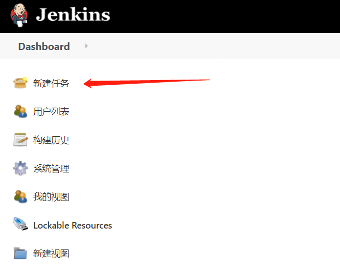
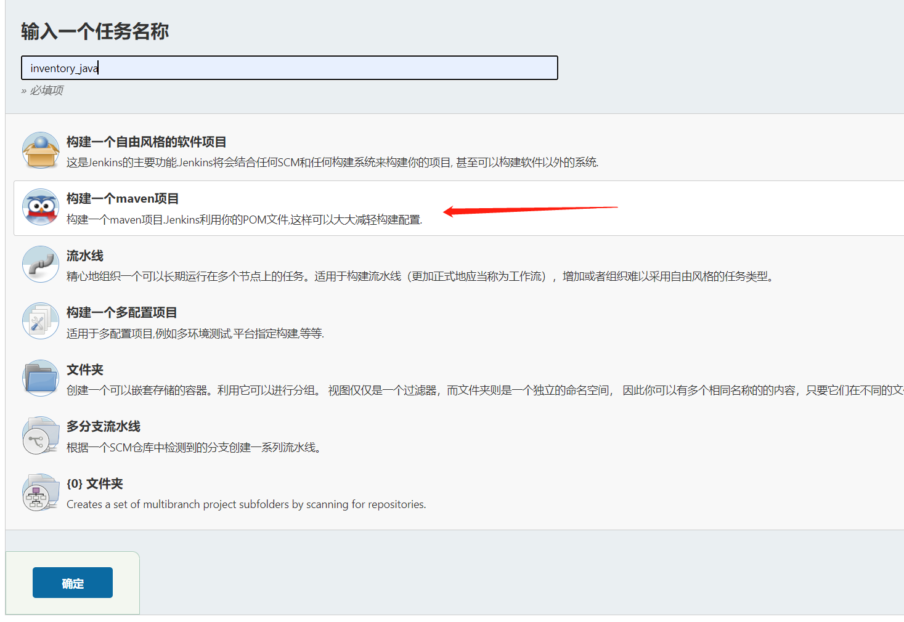
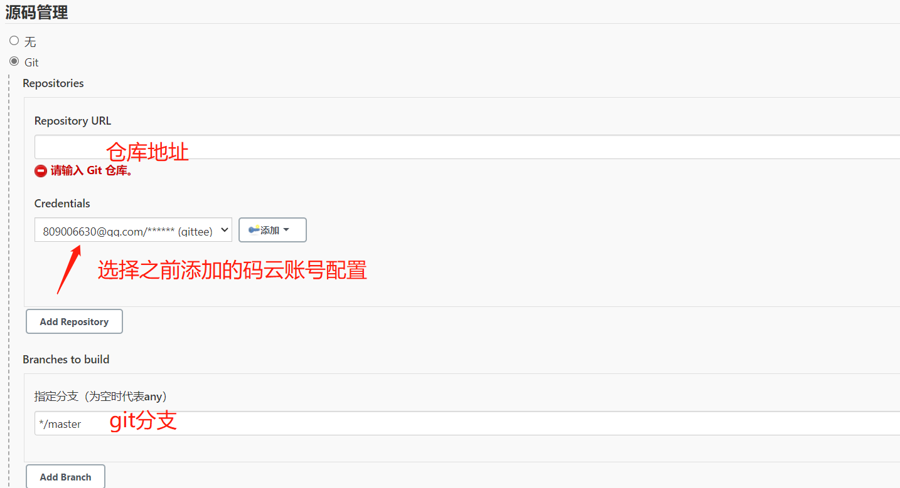
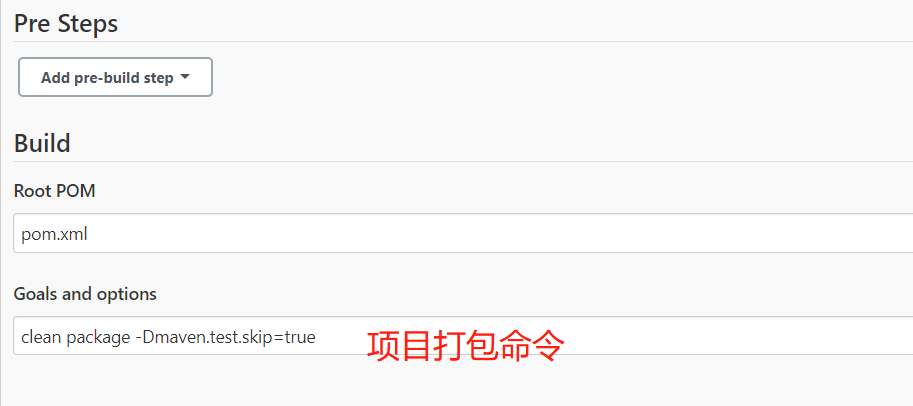
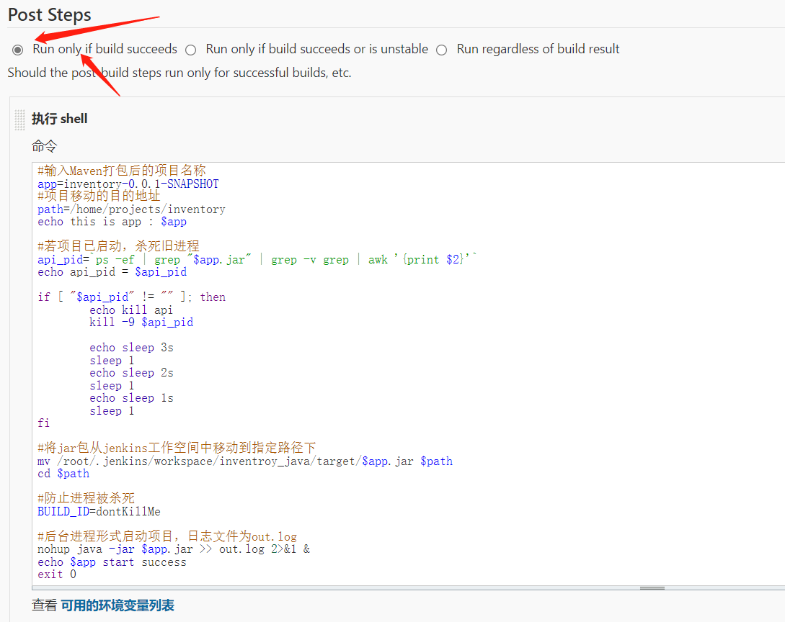
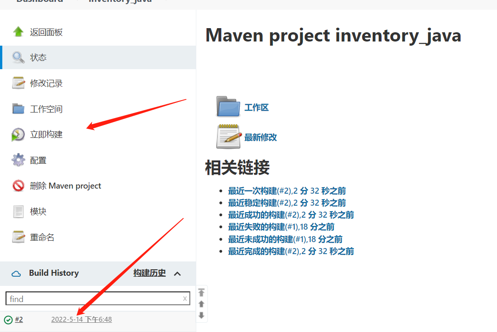
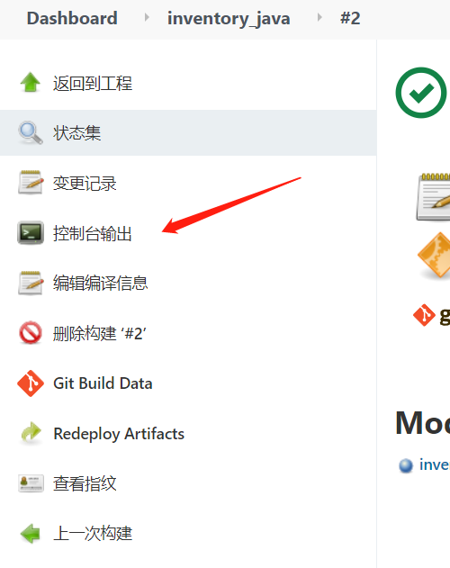
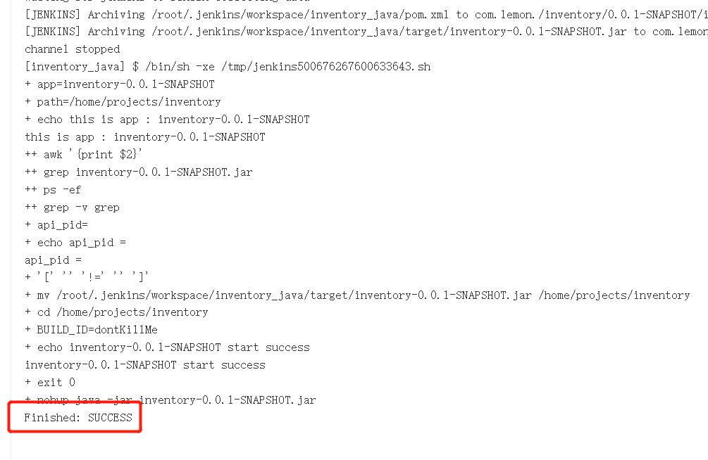
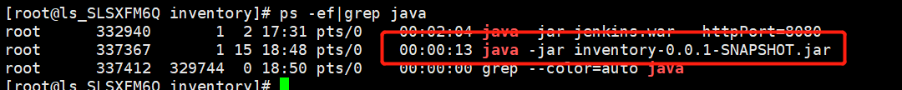

# jenkins管理java项目（使用git代码管理）

### 1. 创建任务



创建maven项目



### 2. Git配置



### 3. Pre Steps



### 4. Post Steps



选择build succeeds，shell命令根据实际项目调整

```linux
#输入Maven打包后的项目名称
app=inventory-0.0.1-SNAPSHOT
#项目移动的目的地址
path=/home/projects/inventory
echo this is app : $app

#若项目已启动，杀死旧进程
api_pid=`ps -ef | grep "$app.jar" | grep -v grep | awk '{print $2}'`
echo api_pid = $api_pid

if [ "$api_pid" != "" ]; then
        echo kill api
        kill -9 $api_pid

        echo sleep 3s
        sleep 1
        echo sleep 2s
        sleep 1
        echo sleep 1s
        sleep 1
fi

#将jar包从jenkins工作空间中移动到指定路径下
mv /root/.jenkins/workspace/inventory_java/target/$app.jar $path
cd $path

#防止进程被杀死
BUILD_ID=dontKillMe

#后台进程形式启动项目
nohup java -jar -Dspring.profiles.active=dev2 $app.jar &
echo $app start success
exit 0
```

### 5. 运行任务



查看控制台输出：



Success则说明成功



服务器上面查看进程：

