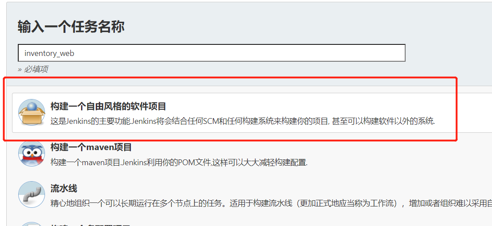
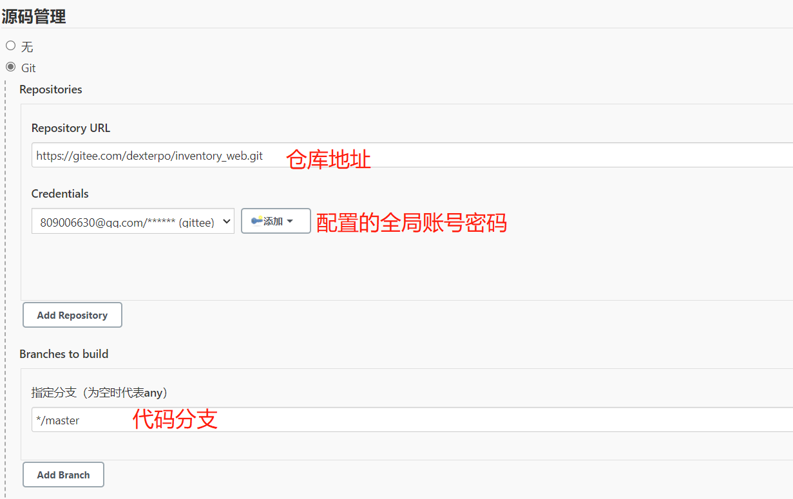
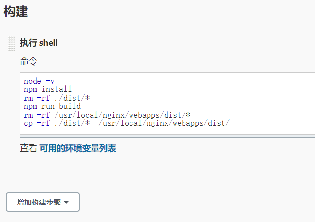
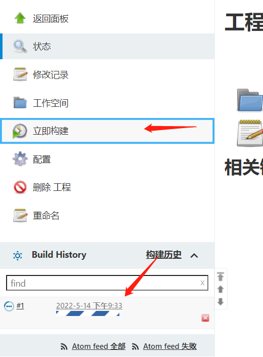
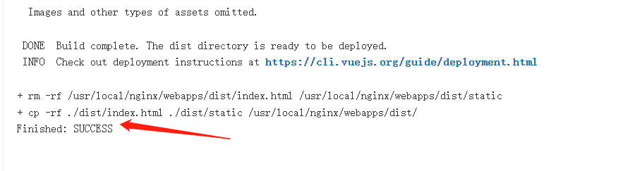

# jenkins管理vue项目

## 1. 创建任务

创建自由风格的软件项目：



## 2. 配置

#### 2.1 Git



#### 2.2 构建

选择执行shell命令(编译vue任务）：



```linux
node -v
npm install 
rm -rf ./dist/*  
npm run build  
rm -rf /usr/local/nginx/webapps/dist/*  
cp -rf ./dist/*  /usr/local/nginx/webapps/dist/
```

## 3.构建

shell执行需要node环境，如果没有node环境，需要配置，参考：



Success则说明成功了

