# linux部署jenkins

### 1. 安装jenkins

我们直接使用war模式运行jenkins，首先下载jenkins的war包：https://www.jenkins.io/download/

下载完成后，放到我们运行的目录，使用java命令跑起来即可：


```linux
java -jar jenkins.war
```

出现下面提示则说明启动成功：

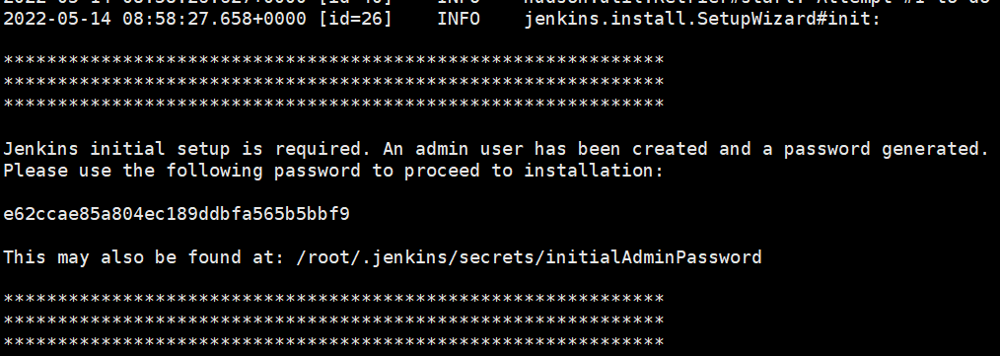

### 2. 配置jenkins

2.1 在浏览器访问jenkins启动的url，进入出现下图则进入配置流程：

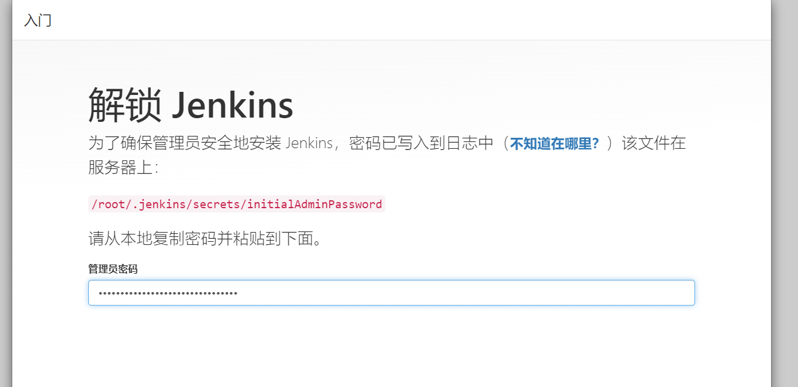

默认密码复制粘贴过来，默认密码位置如图：

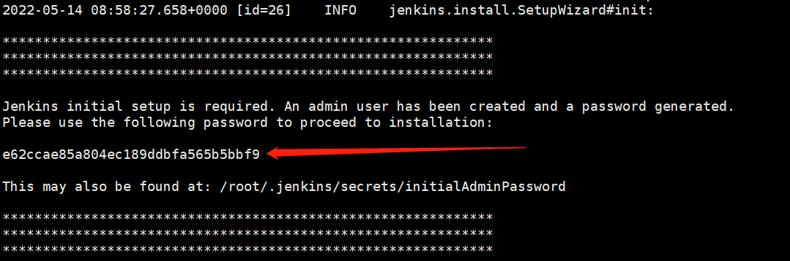


2.2 插件使用默认推荐安装，直接下一步：

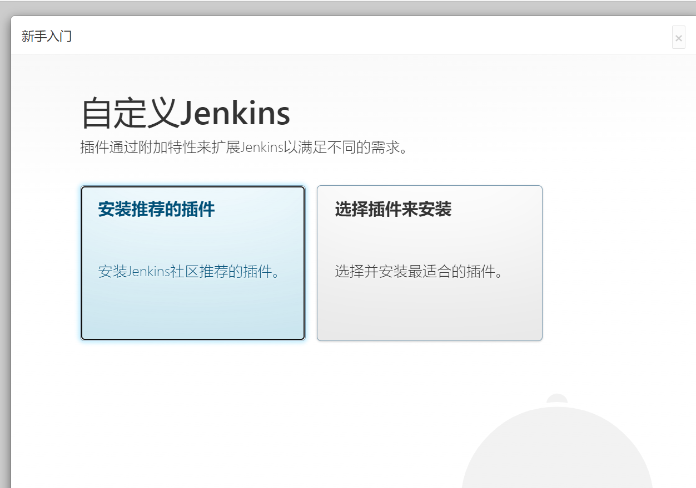

2.3 插件安装完成后进入用户创建页面，创建一个自己的管理员账号，保存好账号密码下一步：


2.4 用户创建之后，实例配置，我们这里默认8080端口：


2.5 配置完成后，进入首页，jenkins配置完成：

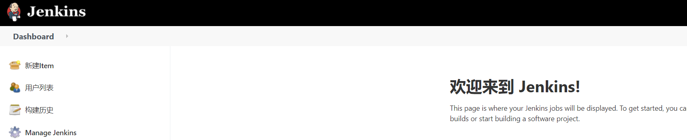

### 3. 编写jenkins启动/停止脚本

3.1 启动脚本

在jenkins启动目录，创建脚本文件：run.sh

```
touch run.sh
vim run.sh
```

添加启动命令：

```
nohup java -jar jenkins.war --httpPort=8080 &
```

授权：

```
chmod +x run.sh
```

启动：

```
./run.sh
```

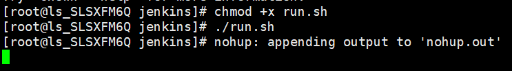

3.2 停止脚本

在jenkins启动目录，创建脚本文件：stop.sh， 编辑停止命令

```
touch stop.sh
chmod +x stop.sh
vim stop.sh
```

```
echo "<-------------------------------------->"
# 查看该jar进程
pid=`ps -ef | grep jenkins | grep -v 'grep' | awk '{print $2}'`
echo "jenkins pid="${pid}
# 存在则kill,不存在打印一下吧
if [ "${pid}" ]; then
	kill -9 ${pid}
    # 检查kill是否成功
    if [ "$?" -eq 0 ]; then
        echo "jenkins stop success"
    else
        echo "jenkins stop fail"
    fi
else
	echo "进程不存在"
fi
```

停止：

```
./stop.sh
```


3.2.2 浏览器关闭jenkins方式：访问：http://localhost:8888/exit （url改成自己服务器url）


### 3. 全局工具配置

3.1 Maven，直接使用默认配置（前提是linux服务器上面，maven已配置好）

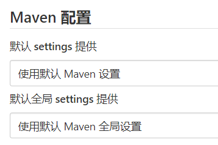

3.2 JDK配置：

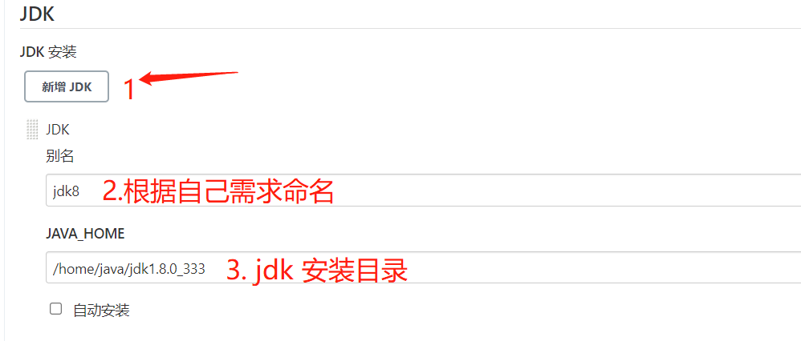

3.3 git

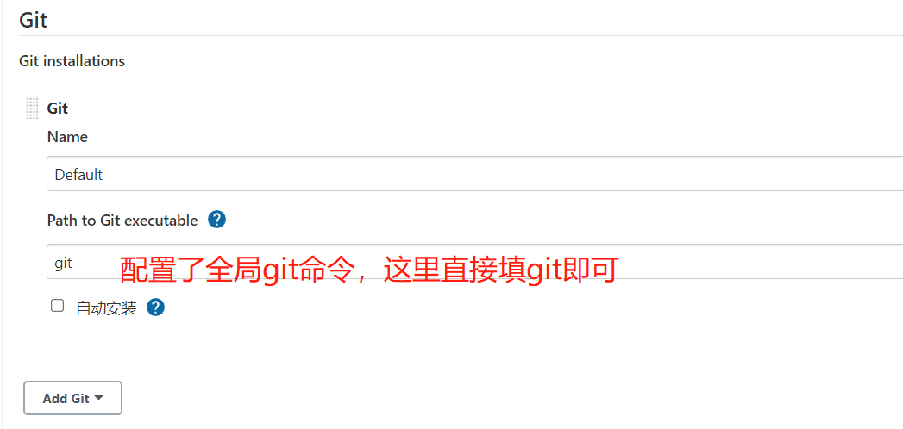

3.4 maven home

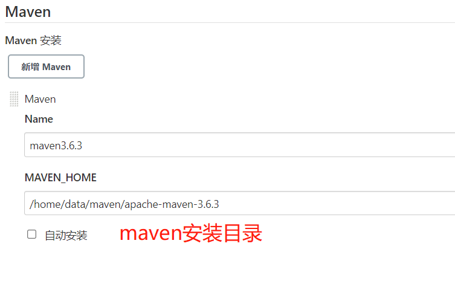


保存即可！

### 4. 全局凭据配置

4.1 添加码云账号

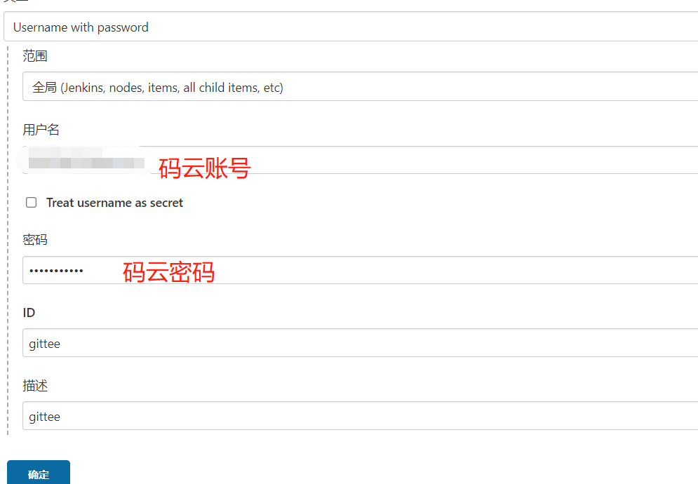

### 5. 插件配置

5.1 maven构建工具插件

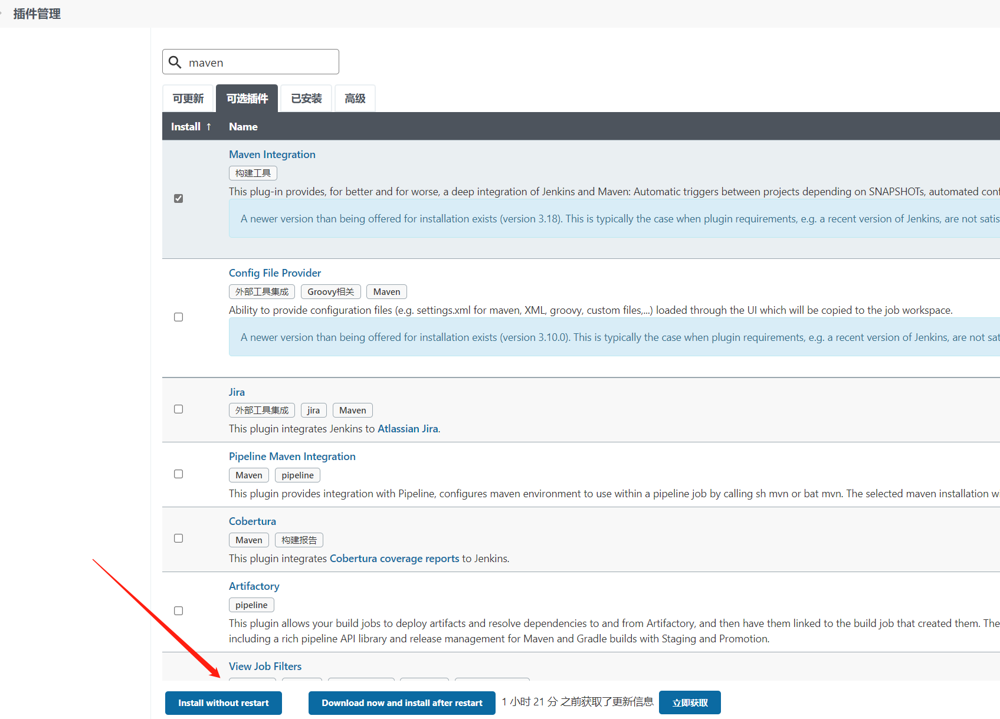

