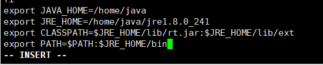
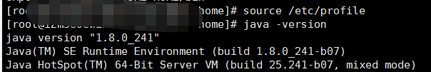

# CentOS8安装JRE

1、通过WinSCP把jre的包传到服务器/home/data下面

2、创建目录， /home/java  
解压jre包到 /home/java  
`` mkdir /home/java
tar -zxvf jre-8u241-linux-x64.tar.gz -C /home/java
`` 

3、为jre文件夹及子文件夹赋予超级用户的权限，并配置环境变量  
赋予权限： chown root:root -R /home/java/jre1.8.0_241/   
环境变量配置：vi /etc/profile  
进入编辑模式在文件中尾处添加：  
``export JAVA_HOME=/home/java
export JRE_HOME=/home/java/jre1.8.0_241
export CLASSPATH=$JRE_HOME/lib/rt.jar:$JRE_HOME/lib/ext
export PATH=$PATH:$JRE_HOME/bin``  
添加完后执行 ：source /etc/profile   （重置环境变量，使得修改生效）

4、执行完成后测试，输入java -version    

成功输出版本号则说明配置成功。 

5、运行java XX 文件时候报错error  
Error: Could not find or load main class MainService  
使用命令：`vi /etc/profile` 打开 `/etc/profile` ，在CLASSPATH=后面加上.:  
修改 export CLASSPATH=$JRE_HOME/lib/rt.jar:$JRE_HOME/lib/ext为export   CLASSPATH=.:$JRE_HOME/lib/rt.jar:$JRE_HOME/lib/ext  
修改完成后添加完后执行 ：source /etc/profile   （重置环境变量，使得修改生效）  