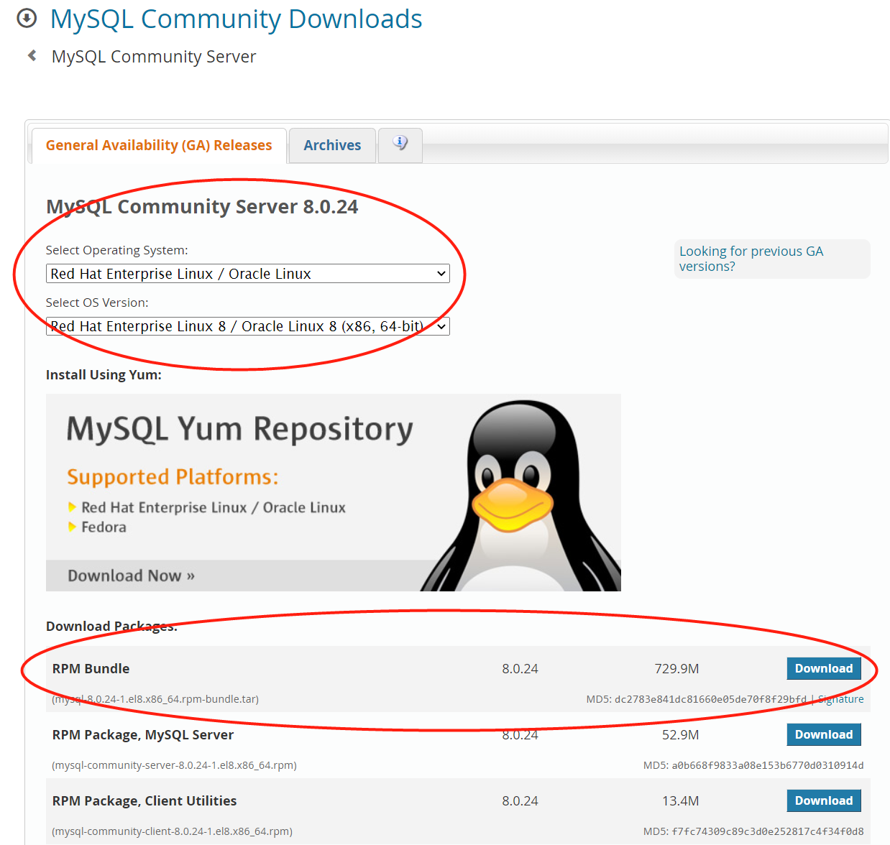
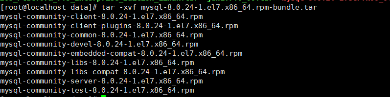
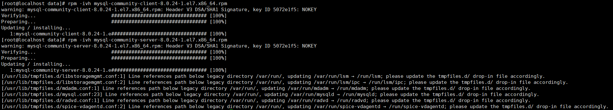
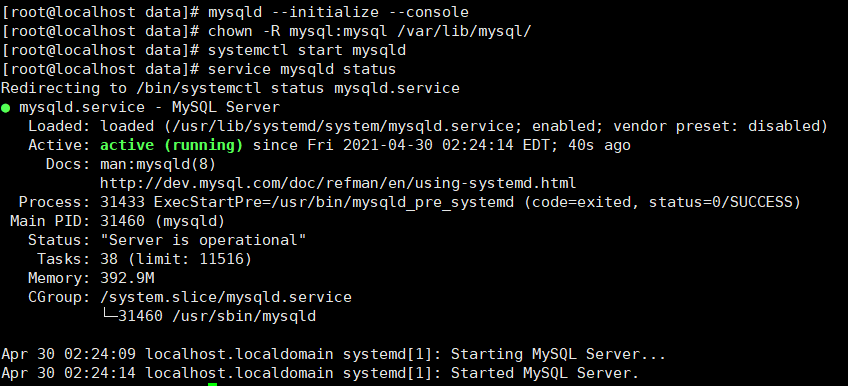
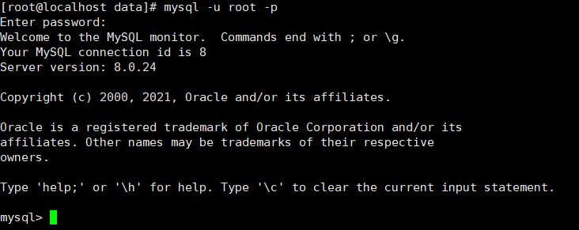
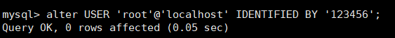
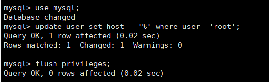
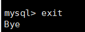
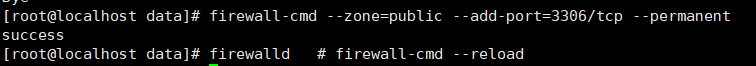
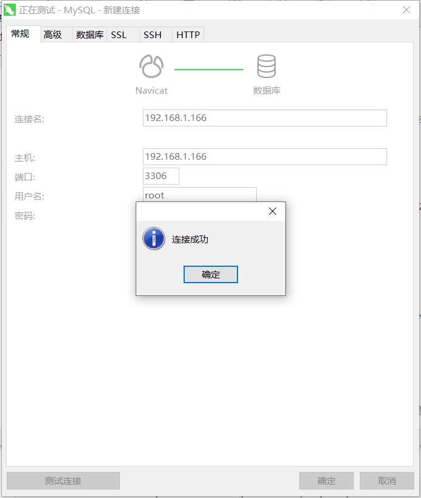

# centos8 安装MySql8

## 1. 下载MySql安装包

[mysql官网下载](https://dev.mysql.com/downloads/mysql/)

选择Red Hat版本8，下载 RPM Bundle版本的包（打包版本，包括Serve/Client...)




## 2. 安装MySql

① 把下载好的安装包上传到linux服务器并解压

`tar -xvf mysql-8.0.24-1.el7.x86_64.rpm-bundle.tar`



② 开始安装mysql，用rpm -ivh命令来进行安装，注意安装顺序，因为这些包的安装是相互依赖的：

- rpm -ivh mysql-community-common-8.0.24-1.el7.x86_64.rpm
- rpm -ivh mysql-community-client-plugins-8.0.24-1.el7.x86_64.rpm
- rpm -ivh mysql-community-libs-8.0.24-1.el7.x86_64.rpm
- rpm -ivh mysql-community-client-8.0.24-1.el7.x86_64.rpm
- rpm -ivh mysql-community-server-8.0.24-1.el7.x86_64.rpm
- 其它的包（dev/test...）可以选择性安装，先暂时最小化安装，不安装这些包



③ 安装时可能遇到的依赖问题：

*error: Failed dependencies:
	libcrypto.so.10()(64bit) is needed by mysql-community-client-plugins-8.0.24-1.el7.x86_64
	libssl.so.10()(64bit) is needed by mysql-community-client-plugins-8.0.24-1.el7.x86_64*

解决：下载安装依赖包，执行命令：**dnf install compat-openssl10**，[参考链接](https://centos.pkgs.org/8/centos-appstream-x86_64/compat-openssl10-1.0.2o-3.el8.x86_64.rpm.html)

*error: Failed dependencies:
	libncurses.so.5()(64bit) is needed by mysql-community-client-8.0.24-1.el7.x86_64
	libtinfo.so.5()(64bit) is needed by mysql-community-client-8.0.24-1.el7.x86_64*

解决：下载安装依赖包，执行命令：**dnf install ncurses-compat-libs**，[参考链接](https://centos.pkgs.org/8/centos-baseos-x86_64/ncurses-compat-libs-6.1-7.20180224.el8.x86_64.rpm.html)

*error: Failed dependencies:
	make is needed by compat-openssl10-1:1.0.2o-3.el8.x86_64*

解决：下载安装make，执行命令：**yum -y install make**

## 3.初始化MySql

① 初始化数据库

**mysqld --initialize --console**

② 目录授权，不授权，MySql无写入权限，会启动失败

**chown -R mysql:mysql /var/lib/mysql/**

③ 启动mysql服务

**systemctl start mysqld**

④ 查看mysql服务状态，running则说明服务启动成功了

**service mysqld status**



⑤ 使用初始化密码登录数据库，初始化密码在mysqld.log里面查看：

**cat /var/log/mysqld.log**


使用root用户初始化密码登录数据库：**mysql -u root -p**



 修改密码(这里改为123456)： **alter USER 'root'@'localhost' IDENTIFIED BY '123456';**



## 4. 远程连接数据库

因为mysql默认白名单模式，没授权的IP无法访问，我们测试，所以让所有IP都可以访问。

① 执行命令：

```sql
use mysql;
update user set host = '%' where user ='root';
flush privileges;
```



Host列指定了允许用户登录所使用的IP，比如user=root Host=192.168.1.1。这里的意思就是说root用户只能通过192.168.1.1的客户端去访问。 user=root Host=localhost，表示只能通过本机客户端去访问。而%是个通配符，如果Host=192.168.1.%，那么就表示只要是IP地址前缀为“192.168.1.”的客户端都可以连接。如果Host=%，表示所有IP都有连接权限。

② 执行命令exit，退出数据库



③ 开启服务器开启端口3306

```sql
firewall-cmd --zone=public --add-port=3306/tcp --permanent
firewalld   # firewall-cmd --reload
```



开通端口之后，测试远程连接，成功则说明连接成功。

