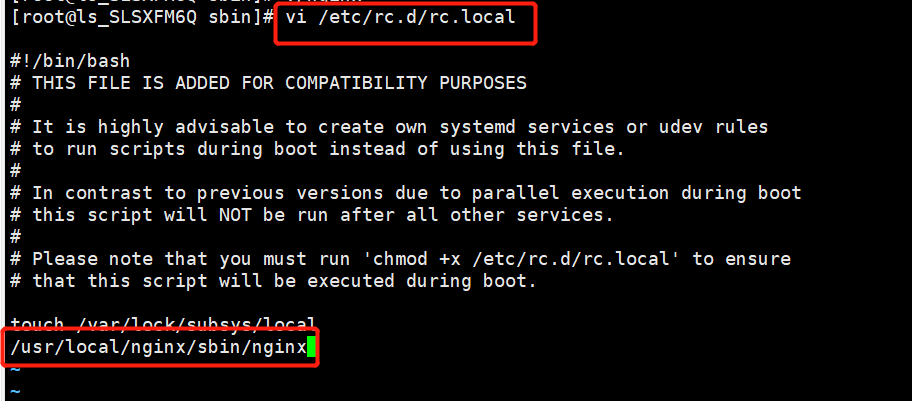

# 安装Nginx

### 1.下载nginx

```linux
wget http://nginx.org/download/nginx-1.16.1.tar.gz 
```

### 2. 安装nginx

##### 2.1 解压安装包

```linux
tar -zxvf nginx-1.16.1.tar.gz
```

##### 2.2 进入解压目录

```linux
cd nginx-1.16.1/
```

##### 2.3 安装依赖

```linux
yum -y install gcc openssl openssl-devel pcre-devel zlib zlib-devel 
```


##### 2.4 安装验证

```linux
./configure
```

##### 2.5 安装

```linux
make && make install
```

### 3.配置nginx

##### 3.1 开放访问端口80（可自定义）

```linux
/sbin/iptables -I INPUT  -p tcp --dport 80 -j ACCEPT
```

##### 3.2 配置nginx为全局指令

##### 编辑/etc/profile文件，在末尾处添加

```linux
PATH=$PATH:/usr/local/nginx/sbin
export PATH
```

刷新配置：

```linux
source /etc/profile
```

### 4. 启动/停止

```linux
cd /usr/local/nginx/sbin
# 默认配置文件启动
./nginx

# 停止指令
./nginx -s stop
```

##### 4.2 开启自启nginx

#### 编辑文件`/etc/rc.d/rc.local`在后面添加内容

````
/usr/local/nginx/sbin/nginx
````



### 5. 访问测试

浏览器访问nginx服务器，出现以下页面则说明访问成功！

