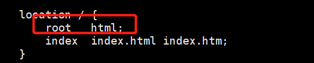
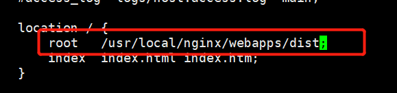

# 部署vue项目到nginx

#### 1. 配置nginx

1.1 我们把项目放在nginx目录下的webapps下面的dist文件夹里面；

```liunx
# 创建文件目录
mkdir /usr/local/nginx/webapps
mkdir /usr/local/nginx/webapps/dist
```

1.2 修改nginx配置文件

```linux
vi /usr/local/nginx/conf/nginx.conf
```

把location 下面的root路径改为我们的项目路径



改成：/usr/local/nginx/webapps/dist



#### 2. 部署vue项目

把编译好的vue项目，放到/usr/local/nginx/webapps/dist目录下面，然后重启nginx

nginx -s reload

浏览器访问主页，成功访问则说明部署成功。

