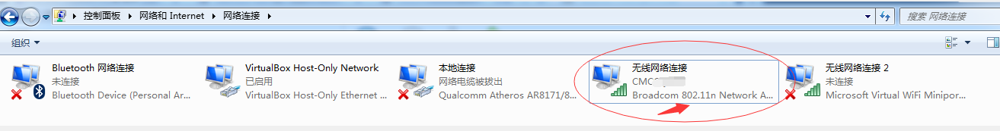
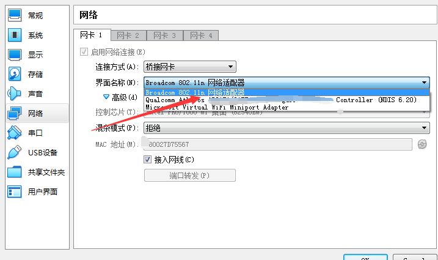
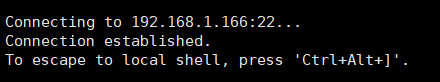

#### 桥接模式下连接虚拟机centos遇到的问题

1. 今天笔记本用wifi连接的网络，开启虚拟机centos之后，主机连接一直失败。最后找到原因：虚拟机网络适配器需要重新选择，有线和无线网使用的不是同一个网络适配器。

   ① 在主机控制面板查看当前使用的网络适配器；
   
   
   
   
   
   ② 在虚拟机网络配置中，把网卡**界面名称**改为主机当前使用的网络适配器；
   
   
   
   
   
   ③ 重启虚拟机，主机连接成功。
   
   
