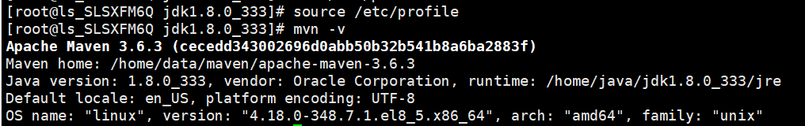

# linux配置maven

#### 1.  下载解压maven包

1.1 下载

```linux
wget https://archive.apache.org/dist/maven/maven-3/3.6.3/binaries/apache-maven-3.6.3-bin.tar.gz
```

2.2 解压

```linux
# 解压
tar -zxvf apache-maven-3.6.3-bin.tar.gz
```

#### 2. 配置maven

2.1 配置环境变量

```linux
#修改配置文件
vim /etc/profile
```

在文件末尾加上：

```linux
export MAVEN_HOME=/home/data/maven/apache-maven-3.6.3
export PATH=$MAVEN_HOME/bin:$PATH
```


刷新配置：

```linux
source /etc/profile
```

测试：mvn -v，提示版本则说明配置成功！



2.2 配置镜像源，配置成国内阿里源，加快下载速度

```
# 编辑配置文件
vim /home/data/maven/apache-maven-3.6.3/conf/settings.xml
```

在<mirrors></mirrors>里面加入：

```xml
<mirror>
      <id>alimaven</id>
      <name>aliyun maven</name>
      <url>http://maven.aliyun.com/nexus/content/groups/public/</url>
      <mirrorOf>central</mirrorOf>
</mirror>
```

