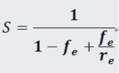

# 第1章  概论

### 1.1 计算机系统的层次结构

一台由软、硬件组成的通用计算机系统可以被看成是按功能划分的多层机器级组成的层次结构。层次结构由高到低依次为**应用语言机器级、高级语言机器级、汇编语言机器级、操作系统机器级、传统机器语言级、微程序语言级**。  

各机器级的实现采用翻译技术或解释技术，或者是这两种技术的结合。**翻译技术是先用转换程序将高一级机器级上的程序整个地换成低一级机器级上等效的程序**，然后在低一级机器级上实现的技术。**解释技术则是在低级机器级上用它的一串语句或指令来仿真高级机器级上的一条语句或指令的功能**，是通过对高级机器级语言程序中的每条语句或指令逐条解释来实现的技术。

### 1.2 计算机系统结构、计算机组成和计算机实现

1、从计算机的层次结构角度来看，**系统结构**是对计算机系统中各级界面的定义及其上下的功能分配；   
**计算机组成**指的是计算机系统结构的逻辑实现，包括机器级内部的数据流和控制流的组成及逻辑设计等；  
**计算机实现**指的是计算机组成的物理实现，包括处理机主存等部件的物件结构。  

2、透明性概念：**在计算机中, 客观存在的事物或属性从某个角度看不到, 称之为“透明”**。这与日常生活中的“透明”的含义正好相反。日常生活中的“透明”是要公开, 让大家看得到, 而计算机中的“透明”, 则是指看不到。所谓透明实际上就是指那些不属于自己管的部分。对于计算机系统结构而言, 凡是编写机器语言和汇编语言程序都要用到的数据表示、指令系统、寻址方式、寄存器组织、I/ O 结构、存储容量及其编址方式、中断机构、系统管态和目态间的切换、信息保护方式和机构等都是不透明的, 而全部由硬件实现的部分, 或是在机器语言、汇编语言编程中不会出现和不需要了解的部分都是透明的。  

### 1.3 计算机系统的软、硬件取舍及定量设计原则

1、计算机功能分别用硬件实现和软件实现的优点和缺点:   
(1) 计算机功能用硬件实现的优点是速度较快，性能好，缺点是不灵活，适应差。  
(2) 计算机功能用软件实现的优点是设计容易，修改容易，有灵活的适用性，缺点是速度、性能低。

2、软、硬件功能分配比例对计算机系统性能的影响：  
(1) 提高硬件功能的比例可以提高解题速度，减少程序所需的存储空间，但会增加硬件成本、降低硬件利用率，降低计算机系统的灵活性和适应性。  
(2) 提高软件功能的比例可以降低硬件成本，提高系统的灵活性、适应性，但解题速度会下降，软件设计费用和所需的存储器用量增加。  

3、软、硬件取舍的基本原则：  
(1) 应考虑现有硬、器件条件下， 系统要有高的性能价格比。  
(2) 要考虑准备采用和可能采用的组成技术，使之尽可能不要过多或不合理地相纸各种组成、实现技术的应用。   
(3) 不能仅从”硬“的角度考虑如何便于应用组成技术的成功和便于发挥器件技术的进展，还应从”软“的角度把如何为编译和操作系统的实现以及高级语言设计程序的设计提供更多、更好的硬件支持放在首位。 

4、Amdahl 定律

- 对系统某部分加速时，其对系统整体影响取决于该部分重要性和加速程度。
- 要想显著加速整个系统，必须提升全系统中相当大的部分的速度。
- 系统加速比=系统性能（改进后）/系统性能（改进前）=总执行时间（改进前）/总执行时间（改进后）。

5、计算机系统“从中间开始”设计方法的优点和缺点：  
优点：它可以克服“由上往下”和“由下往上“两种设计方法中，软、硬件设计分离和脱节的致命缺点；既考虑到硬、器件的现状和发展，又考虑到可能使用的算法和数据结构。  
缺点：要求设计者应同时具备丰富的软件、硬件、器件的应用等方面知识；软件设计周期一般比较长，需要有效的软件设计环境和开发工具。

### 1.4 软件、应用、器件的发展对系统结构的影响

软件的可移植性：软件不修改或只经少量修改就可由一台机器移植到另外一台机器上运行，同一软件可应用于不同的环境。  

1、采用软件移植的主要技术：  

(1) 统一高级语言：统一高级语言是设计一种对各种应用领域都能获得高效率的通用高级语言。这样,在结构相同以至完全不同的机器之间, 通过配上不同的语言翻译程序就可以实现高级语言应用软件的移植。然而, 目前还没有一种对各种应用真正通用的高级语言。这是因为:    

- 不同的用途要求语言的语法、语义结构不同；
- 人们对语言的基本机构看法不一；
- 即使使用同一种高级语言在不同厂家的机器上也不能完全通用；
- 受习惯势力阻扰，人们不愿抛弃管用的语言，因为熟悉、有经验，也不愿抛弃长期累积的、用原有语言编写并已被实践证明是正确的软件。

(2) 采用系列机：  系列机较好地解决了软件环境要求相对稳定和硬、器件技术迅速发展的矛盾。软件环境相对稳定就可以不断累积、丰富、完善软件，使软件产量、质量不断提高，同时又能不断采用新的器件和硬件技术，使之短期内便可提供新的、性能不断提高的机器。   
兼容：向上（下）兼容指的是按某档机器编制的软件，不加修改就能运行于比它高（低）档的机器上，**同一系列的软件一般应做到向上兼容，但不一定向下兼容**。   
向（前）后兼容指的是在按某个时期投入市场的该型号机器上编制的软件，不加修改就能运行于在它（前）后投入市场的机器，**系列机软件必须保证向后兼容，力争向前兼容**。  

(3) 模拟和仿真：模拟和仿真能在结构不同的机器之间实现机器语言程序的移植。  
用机器语言程序解释其他机器的机器指令来实现软件移植的方法称为**模拟**。进行模拟的机器称为宿主机, 被模拟的机器称为虚拟机。模拟方法在机器指令系统差异比较大的时候, 会使程序运行速度严重下降。  
用微程序直接解释其他机器的机器指令来实现软件移植的方法称为**仿真**。进行仿真的机器称为宿主机, 被仿真的机器称为目标机。  
仿真可以提高被移植软件的运行速度, 但机器结构差异较大时, 很难仿真, 须与模拟结合才行。  
模拟和仿真的区别是: 模拟是用机器语言程序解释, 其解释程序保存在主存中; 仿真是用微程序解释, 其解释程序保存在控制存储器中。

2、非用户片的定义：称为通用片，其功能是由器件厂家生产时固定的，器件的用户只能使用，不能改变器件内部功能；  
现场片的定义：用户根据需要可改变器件内部功能；  
用户片的定义：专门按用户要求生成的高集成度VLSI器件，完全按用户要求设计的用户片称为全用户片。

### 1.5 系统结构中并行性开发及计算机系统的分类

1、解题中具有具有同时进行运算或操作的特性，称为**并行性**。并行性包含同时性和并发性二重含义。同时性指的两个或多个时间在同一时刻发生，并行性指的是两个或多个时间在同一时间间隔发生。   

   从计算机系统执行程序的角度来看，并行性等级从低到高分为四级：

   - 指令内部：一条指令内部各个微操作之间的并行执行；
   - 指令之间：多条指令的并行执行；
   - 任务或进程之间：多个任务或程序段的并行执行；
   - 作业或程序之间：多个作业或多道程序的并行执行。

   从计算机系统中处理数据的角度看，并行性等级从低到高分为四级：

   - 位串字串：同时只对一个字的一位进行处理；
   - 位并字串：同时对一个字的全部位进行处理；
   - 位片串字并：同时对许多字的同一位进行处理。
   - 全并行：同时对许多字的全部或部分位组进行处理。

2、并行性开发的途径：

   - 时间重叠：在并行性概念中引入时间因素，让多个处理过程在时间上相互错开，轮流重叠地使用同一套硬件设备的各个部分，加快硬件周转来赢得速度；
   - 资源重复：在并行性概念中引入空间因素，通过重复设置硬件资源来提高可靠性或性能；
   - 资源共享：使用软件方法，让多个用户按一定时间顺序轮流使用同一套资源来提高资源利用率。

3、 计算机系统的分类：

- 按指令流和数据流的多倍性对计算机系统分类，分为：单指令流单数据流（SISD）、单指令多数据流（SIMD）、多指令流单数据流（MISD）和多指令流多数据流（MIMD)；
