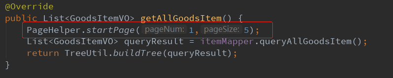
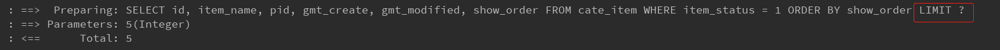

# springboot+mybatis配置分页插件（pagehelper）

### 1. 导入依赖

```xml
<dependency>
    <groupId>com.github.pagehelper</groupId>
    <artifactId>pagehelper-spring-boot-starter</artifactId>
    <version>1.2.13</version>
</dependency>
```

注意：这里导入的artifactId是starter，导入官方包会导致分页无效。

### 2. application.yml中引入配置

在项目配置yml文件中加入分页插件的参数（可以不配置，使用默认值，分页插件一样正常工作）。

```xml
pagehelper:
  helperDialect: mysql
  reasonable: true
  supportMethodsArguments: true
  params: count=countSql
```

### 3. 在原有查询逻辑前调用PageHelper.startPage方法



在你需要进行分页的 MyBatis 查询方法前调用 `PageHelper.startPage` 静态方法即可，紧跟在这个方法后的第一个**MyBatis 查询方法**会被进行分页。



调用后查看日志，可以看到分页插件在sql中动态添加了LIMIT

### 4. 总结

就是这么简单，导入依赖后直接调用静态方法就可以使用分页插件了。

参考：[官方Github仓库](https://github.com/pagehelper/Mybatis-PageHelper)

[Spring Boot 集成 MyBatis分页插件](https://github.com/pagehelper/Mybatis-PageHelper/blob/master/wikis/en/HowToUse.md)

### 5. 原理浅析

参考：https://mp.weixin.qq.com/s/79e5okpm-GxOoL07eDegq