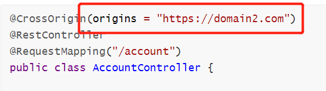

# SpringBoot启用跨域请求（CORS）

# 1.1 什么是跨域

跨域是指不同域名之间的相互访问，这是由浏览器的同源策略决定的，是浏览器对JavaScript施加的安全措施，防止恶意文件破坏。

**同源策略**：同源策略是一种约定，它是浏览器最核心的也是最基本的安全策略，如果缺少了同源策略，则浏览器的正常功能可能会受到影响。
所谓**同源**就是说**协议** ，**域名**，**端口号**完全一致，有一个不一致就会造成跨域问题。

**跨域原理：**

- 跨域请求能正常发出去，**服务端能接受到请求并正常返回结果**，只是结果被拦截了。
- 跨域只存在于浏览器，不存在于其他平台，比如安卓/java/ios等平台。
- 之所以会发生跨域是因为受到了同源策略的限制，同源策略要求源相同才能进行正常通信，即**协议，域名，端口号**都完全一致。

**URL** ：统一资源定位符，它是www的统一资源定位标志，也就是我们说的网络地址。它的**一般格式**为：协议类型://服务器地址:端口号/路径。这也就是我们说的跨域中的域。

# 1.2 在SpringBoot中解决跨域的方法

### 1.2.1 @CrossOrigin

可以放在类或者方法上面，启用跨域请求。

a. 放在类上面，则整个类下面所有方法都默认启用跨域请求：

```java
@CrossOrigin(origins = "https://domain2.com")
@RestController
@RequestMapping("/account")
public class AccountController {

    @GetMapping("/{id}")
    public Account retrieve(@PathVariable Long id) {
        // ...
    }

    @DeleteMapping("/{id}")
    public void remove(@PathVariable Long id) {
        // ...
    }
}
```

b. 放在方法上面，则该方法启用跨域请求：

```java
@CrossOrigin
@RestController
@RequestMapping("/account")
public class AccountController {

    @CrossOrigin("https://domain2.com")
    @GetMapping("/{id}")
    public Account retrieve(@PathVariable Long id) {
        // ...
    }

    @DeleteMapping("/{id}")
    public void remove(@PathVariable Long id) {
        // ...
    }
}
```

注意：请求网址需要改为你允许跨域请求的网址：



### 1.2.2 全局配置

#### 1.2.2.1 Java Configuration

很多时候，整个项目都需要支持跨域请求，每个类都声明@CrossOrigin就太麻烦了，这时候我们就可以实现WebMvcConfigurer的addCorsMappings接口，使整个项目都开启跨域请求支持。

```java
import org.springframework.context.annotation.Configuration;
import org.springframework.web.servlet.config.annotation.CorsRegistry;
import org.springframework.web.servlet.config.annotation.EnableWebMvc;
import org.springframework.web.servlet.config.annotation.WebMvcConfigurer;

@Configuration
@EnableWebMvc
public class WebConfig implements WebMvcConfigurer {

    @Override
    public void addCorsMappings(CorsRegistry registry) {
        registry.addMapping("/**")
                .allowedHeaders("*")
                .allowedMethods("*")
                .allowCredentials(true)
                .allowedOrigins("http://localhost:8083", "http://localhost:8080"); // 可变参数，可允许多个网址
    }
}
```

## 1.3 参考

1、[Cross-Origin Resource Sharing (CORS)介绍](https://developer.mozilla.org/en-US/docs/Web/HTTP/CORS)

2、[SpringMVC-CORS 官方文档](https://docs.spring.io/spring-framework/docs/current/reference/html/web.html#mvc-cors)


