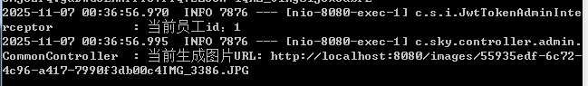

# SpringBoot本地存储文件

# 1.1 需求来源

未使用文件存储服务商，而且文件数据量很小，文件部署到当前部署包的指定目录即可，不影响下次更新部署。使用java -jar 启动程序后，可以正常保存和回显文件。

# 1.2 处理方法

### 1.2.1 Controller方法

```java
    @PostMapping("/upload")
    public Result<String> upload(MultipartFile file) {

        String originalFilename = file.getOriginalFilename();

        // 当前文件服务器地址
        String currentPath = new File("").getAbsoluteFile().getPath();
        String savePath = currentPath + uploadPath;
        // 保存时候的文件名字
        String objectName = UUID.randomUUID().toString() + originalFilename;

        try {
            // 保持到当前文件目录（目录路径配置在yml参数uploadPath）
            // 如果当前文件目录不存在就创建
            File currentFileDir = new File(savePath);
            if (!currentFileDir.exists() && !currentFileDir.isDirectory()) {
                currentFileDir.mkdir();
            }
            // 存储文件到指定文件目录
            file.transferTo(new File(savePath + objectName));

            log.info("当前生成图片URL: {}",  currentImgUrl + objectName);

            return Result.success(currentImgUrl + objectName);
        } catch (IOException e) {
            log.error("上传失败： {}" , e);
        }

        return Result.error(MessageConstant.UPLOAD_FAILED);
    }
```

### 1.2.2 Spring文件配置，WebMvcConfiguration，添加静态资源映射

```java
    protected void addResourceHandlers(ResourceHandlerRegistry registry) {
        log.info("开始设置静态资源映射...");
        registry.addResourceHandler("/webjars/**").addResourceLocations("classpath:/META-INF/resources/webjars/");

        String currentWorkingDir = System.getProperty("user.dir");
        // 当前文件服务器地址，为当前项目下uploadPath目录下
        String locations = "file:" + currentWorkingDir + uploadPath;

        registry.addResourceHandler("/images/**")
                .addResourceLocations(locations);
    }
```

### 1.2.3 yml配置当前文件夹+服务器部署对应端口

~~~xml
file:
  upload-path: /files/
  currentImgUrl: http://localhost:8080/images/
~~~


## 1.3 部署项目包，可以正常存储提取文件





#### 在部署包的文件夹内，按配置目录成本存储对应文件。

