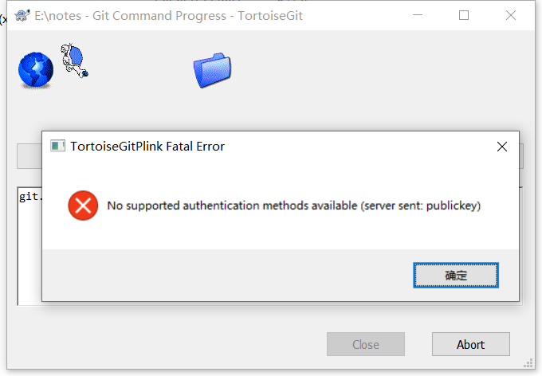
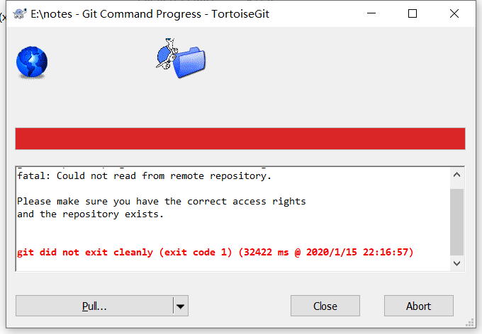
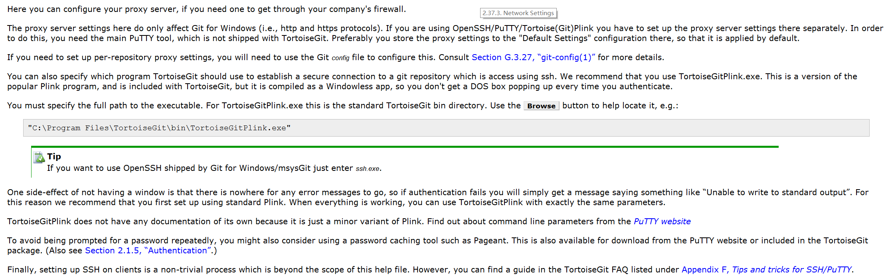
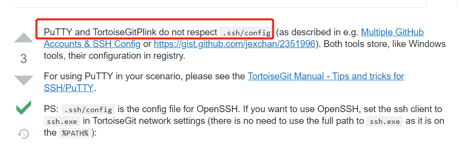
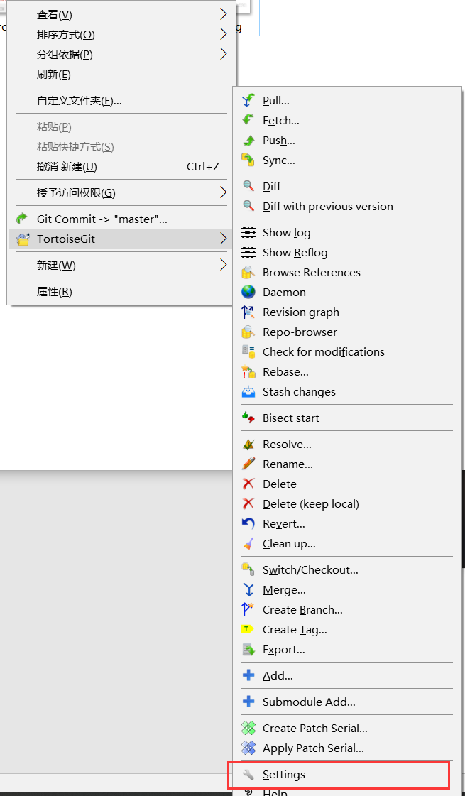
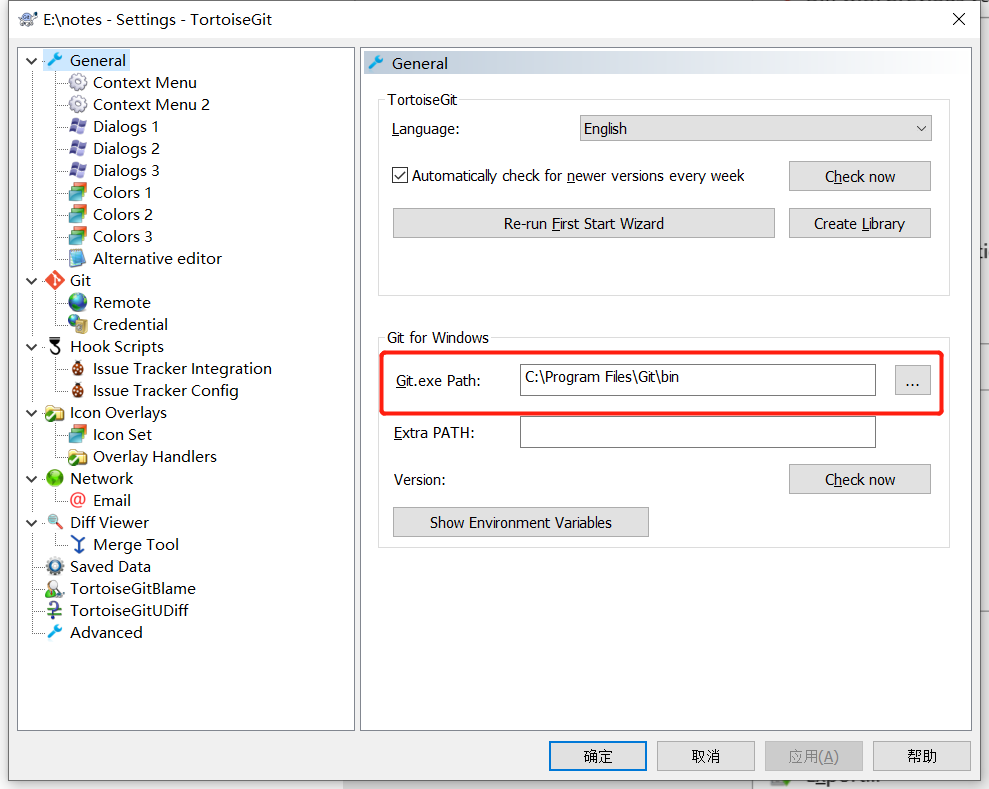
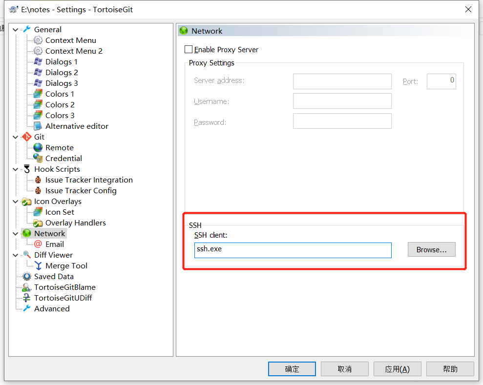
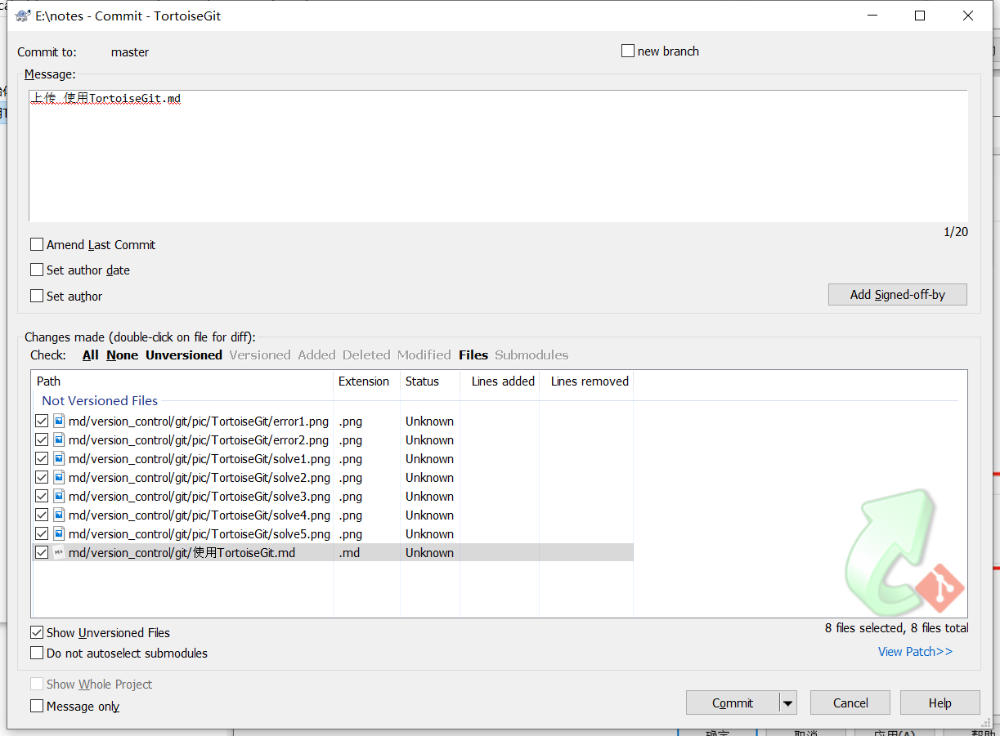
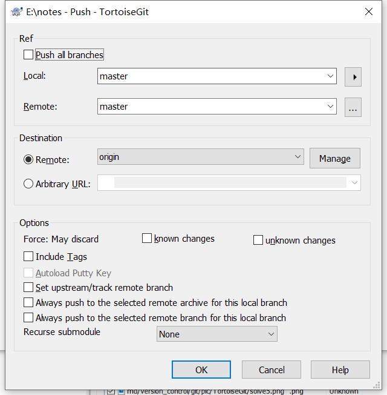
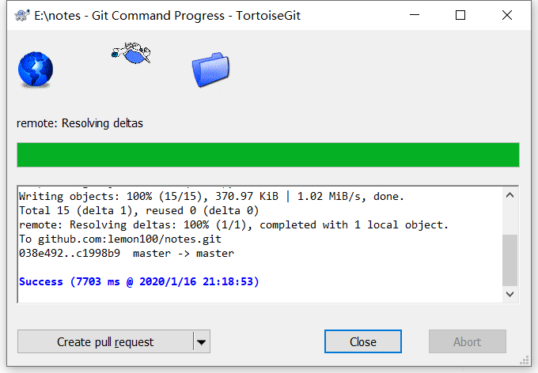

# 使用TortoiseGit管理
a.安装完成TortoiseGit之后，尝试更新，发现以下问题。  

b.看帮助文档发现，是因为我们初始化git使用的git bash，生成的.ssh/config不被TortoiseGit使用的默认SSH Client（TortoiseGitPlink）识别。  

c. 解决方式：

打开TortoiseGit的setting，  

选择General，把Git.exe path改到我们安装git的地址：  

选择Network，把SSH client改为ssh.exe或者ssh.exe全路径（C:\Program Files\Git\usr\bin\ssh.exe）  

d. 尝试commit文件并push到github

①commit  

② push到github  

### Success

