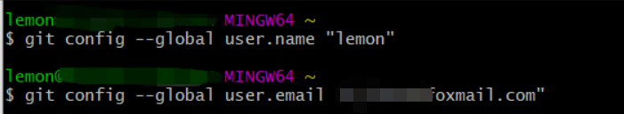
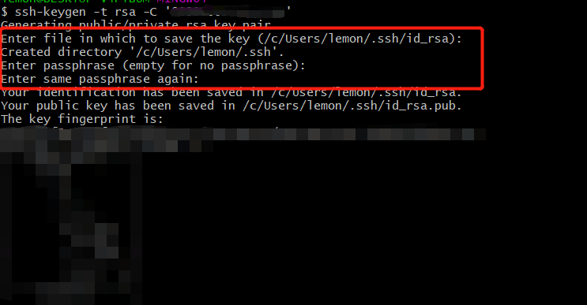
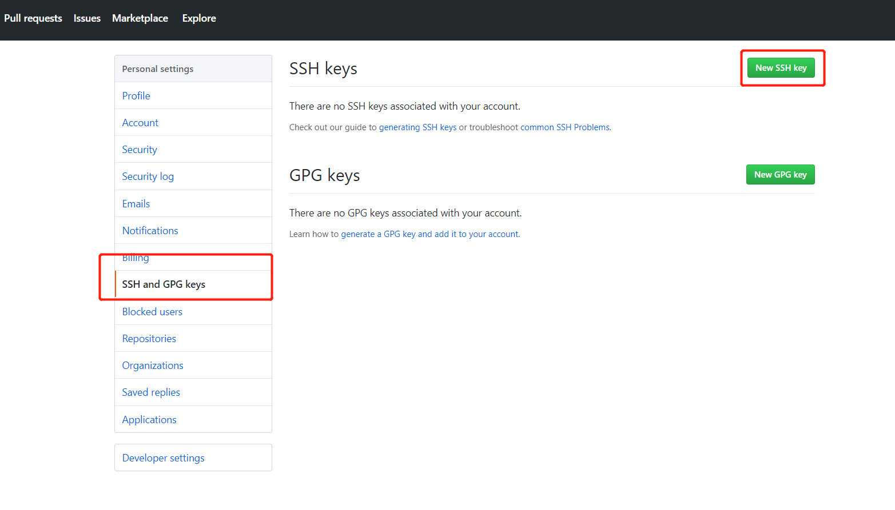
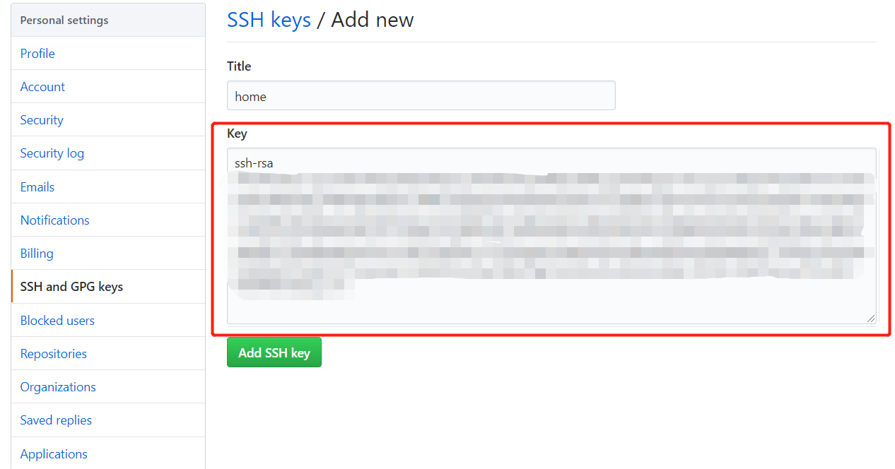
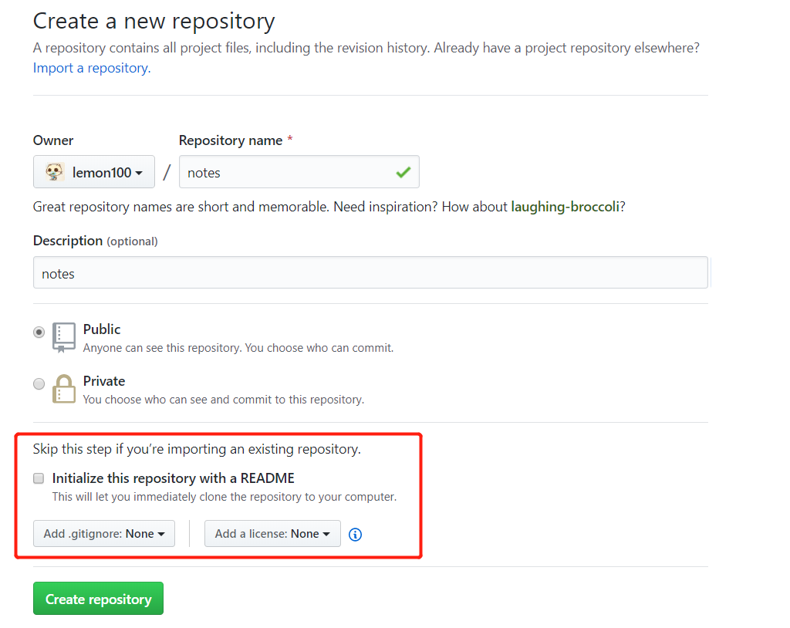
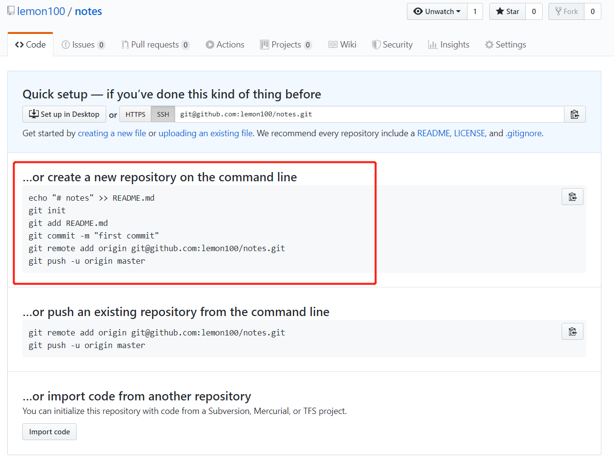
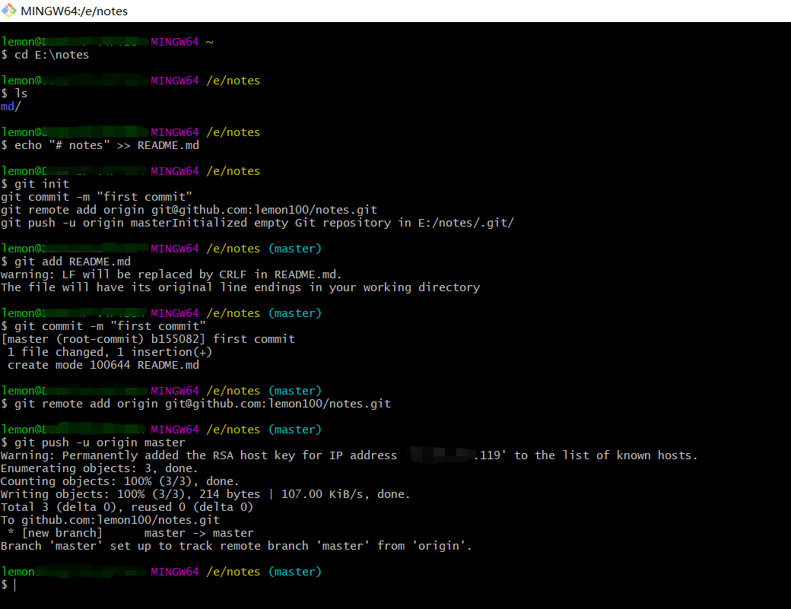
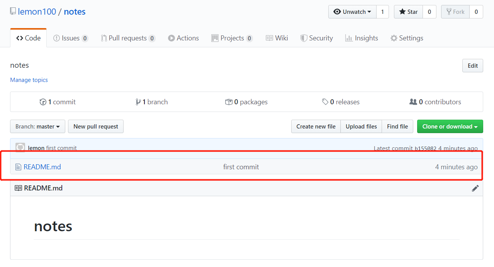
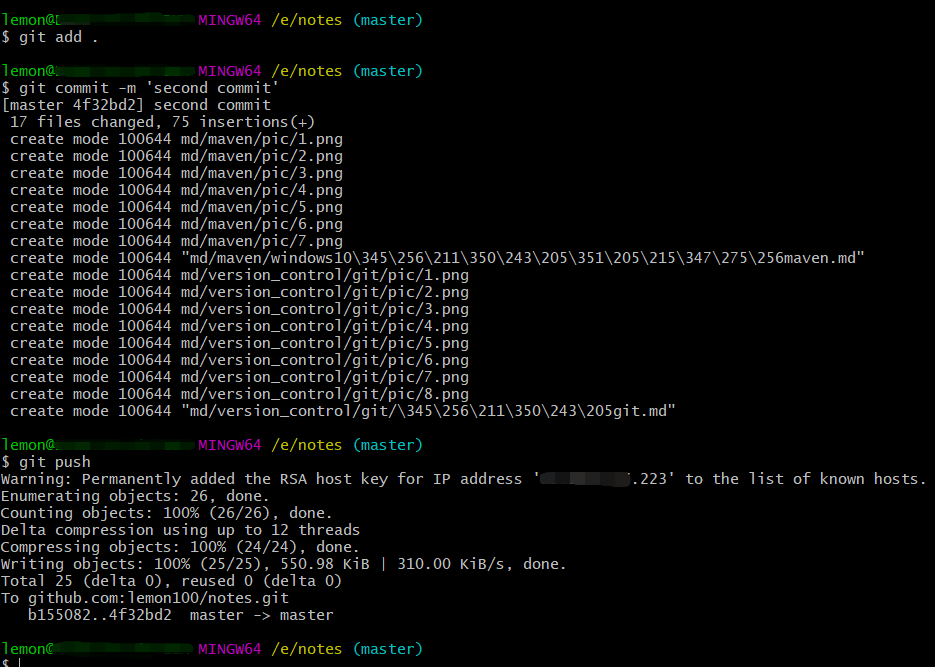
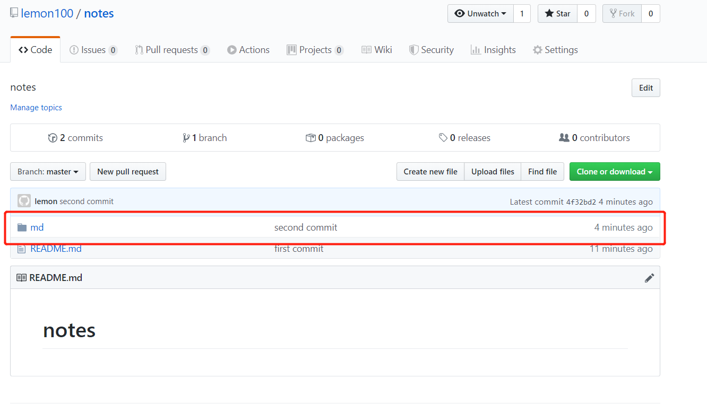

# 配置git，并配置到github
### 1. 配置用户信息
打开Git Bash，配置用户信息  
```
$ git config --global user.name "XXX"
$ git config --global user.email "XXX@xxx.com" 
```


### 2. 生成秘钥
```
ssh-keygen -t rsa -C '登录邮箱'
```
密码直接回车就好，注意秘钥保存的路径。  



### 3.配置到github
a. 登陆到github，进入 路径Settings-> SSH keys->New SSH key  

b. 进入本地电脑中秘钥保存的路径（就是第二部生成的秘钥），打开.ssh文件夹下的id_rsa.pub，复制所有内容，粘贴到github上。  


### 4.本地创建项目并推送到github
a. github上面需要先建一个仓库，不要勾选 <u>Initialize this repository with a README</u>   


b. 初始化本地项目  
① 仓库创建成功后，github会提示你怎么初始化你的仓库，我们选择第二种方式，创建一个新的本地仓库。  

② 打开Git Bash， 进入我们要初始化的文件夹，复制github提供的git命令。  


执行完成之后，在github仓库里面就能看到我们初始化的内容了。  

③ 尝试提交文件到github上  

```
git add .
git commit -m 'second commit'
git push
```


push成功后，在github仓库就能看到提交的文件。  
